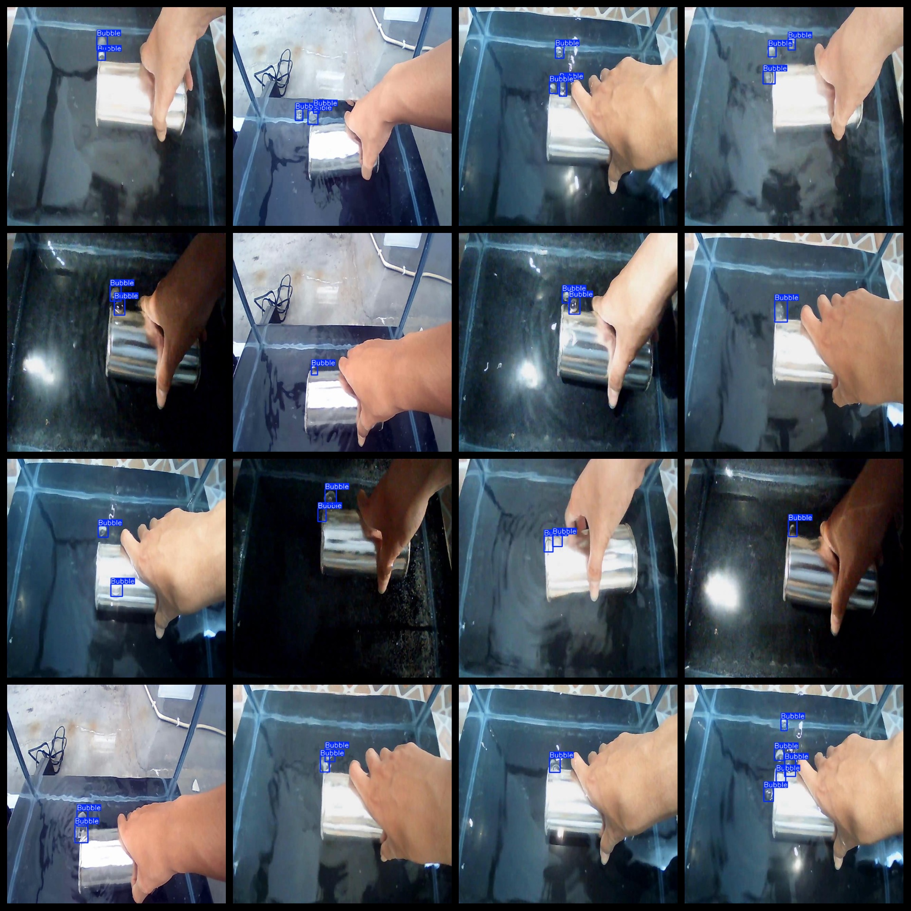

# Can Water in Leak Bubbles Detection Dataset 3794 imagesYOLO-VOC format

3794 voc + yolo datasets for air bubble detection in cans of water

Dataset Format: VOC format + YOLO format

The compressed file contains: three folders, each storing images, xml files, and text files.

Total jpg images in JPEGImages folder: 3794

The total number of XML files in the Annotations folder is 3794.

The total count of txt files in the labels folder is 3794.

Number of tag types: 1

Tag names: ["Bubble"]

The number of boxes for each label (Note that the order of labels in the Yolo format does not correspond to this, but is based on the classes.txt file in the labels folder):

Bubble frame count = 7020

Total boxes: 7020

Picture clarity (Resolution: Pixels): Clear

Is the image enhanced: No

Shape of the label: Rectangular box, used for object detection and recognition.

Important Note: None

Special Notice: This dataset does not guarantee the accuracy or precision of the trained models or weight files. The dataset only provides accurate and reasonable annotations.

Annotation and image details are as follows:

## Images

---

Here is a pay link on Stripe (https://buy.stripe.com/3cs8yP7sY87d0vu9AB). Please contact me lonlonago@foxmail.com after funding $89, and I will send you a complete data files, thank you!

